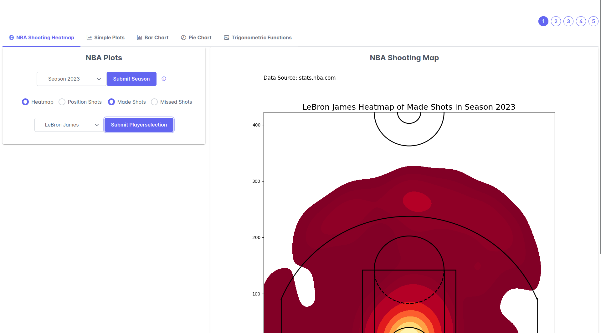
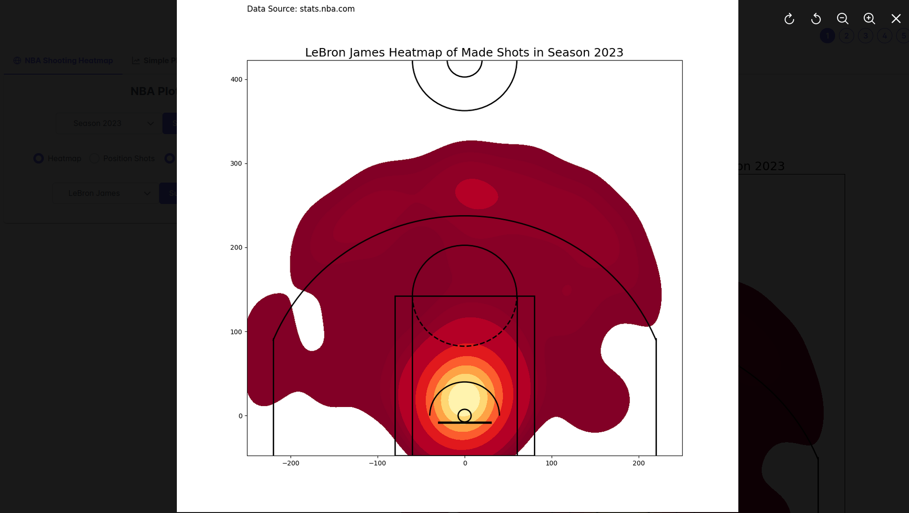
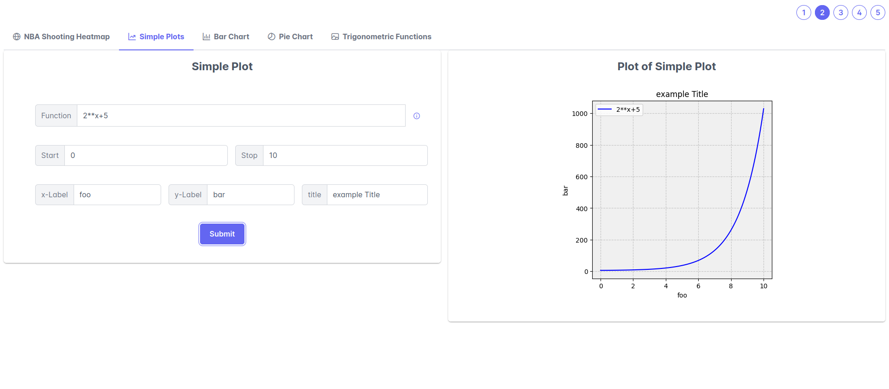
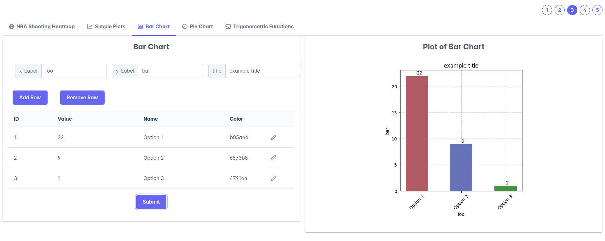
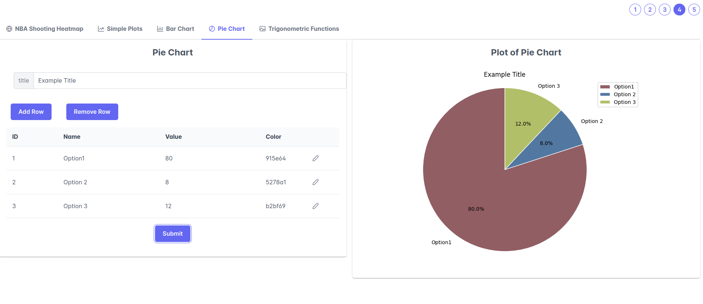
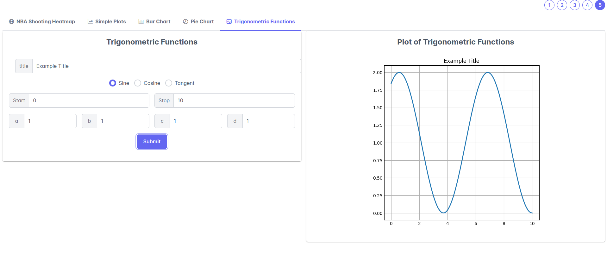

[](https://classroom.github.com/a/9FxAlQXs)

# Advanced Visualization Project with Matplotlib

## Setup
1. Clone this project.
2. Refer to https://drive.google.com/file/d/1paCz-3DwEPFfSR1KP6cKslzKM3FPQY1p/view?usp=sharing to get the CSV-File with all the data.
3. Extract the CSV-File: NBA_2004_2023_Shots.csv and Copy the file into the folder: pythonbackendwithdocker/pythonbackend/data/
4. In the root-directory of this project run:
  ```bash
  docker-compose up
  ```
1. open: http://localhost:8080 (this is the frontend)
2. have fun

(Note that docker and docker-compose should be installed and the docker daemon should be running. Also make sure that neither port 8080 or port 5000 are busy.)

## Images

_image of frontend with NBA Shooting Map selected as option_


_preview on click of the image_


_example of simple plot_


_example of bar chart_


_example of pie chart_


_example of trig func_
## Overview

This project aims to visualize NBA shooting statistics for individual players across different seasons. Also this project includes simple plots, trigonometric plots, bar charts, and pie charts to be able to plot comprehensive charts with minimal effort for the user.

## Goals

The goals of this project are as follows:

1. **Data Visualization**: Provide intuitive and informative visualizations of NBA shooting statistics to understand player shooting preferences better.

2. **Analysis**: Analyze shooting patterns and trends for individual players over multiple seasons.

3. **Facilitate Plotting**: With only a few inputs, the user is able to get good-looking and comprehensive plots.


## Why This Project?

The motivation behind this project stems from a passion for basketball and data analysis. By visualizing NBA shooting stats, I aimed to provide fans with a deeper understanding of player performance.


## Features

### NBA related plots:
- **Heat Map**: User can plot heat map of missed/made shots per player and season.
- **Shooting Position Marker**: User can plot shooting positions of missed/made shots per player and season.

### Not NBA related plots:
- **Simple Plots**: User is able to input an function and receive a plot of this function with the specified properties of the graph.
- **Trigonometric Plots**: Same as _Simple Plots_ only for trigonometric functions such as sine, cosine, and tangent.
- **Bar Charts**: User can input multiple names, values and colors to receive a Bar chart.
- **Pie Charts**: User can input multiple names, values and colors to receive a Pie Chart.

## Usage

1. **Data Collection**: Used the data of [stats.nba.com](https://www.stats.nba.com)
2. **Visualization**: Implement various visualization techniques using libraries such as Matplotlib.
3. **Interactivity**: Graphical User Interphase using Vuejs.
4. **Automation**: Automation of Plotting with Matplotlib thanks to the Web Interface.
5. **Deployment**: Deploy the visualization project on a web platform or share it in docker format.

## Technologies Used

- Python: Data processing and visualization
  - pandas
  - sqlite3
  - csv
  - seaborn
  - numpy
- Matplotlib: Creating static plots and charts
- Flask: Web application framework for deployment
- Axios: Handling HTTP requests for data retrieval
- Vue.js: Frontend framework for user interface development
- PrimeVue: UI components libary for Vuejs
- Docker: Accelerated Container Application Development

## License

This project is licensed under the [MIT License](LICENSE).

